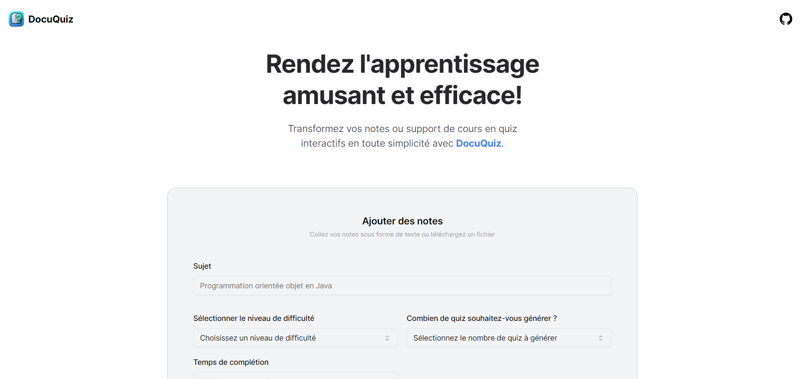

<div align="center">
  
</div>
<h1 align="center">
  DocuQuiz
</h1>



#### DocuQuiz is a simple and user-friendly app designed to effortlessly convert your notes and documents into interactive quizzes.

#### Fork of [Quiznote](https://github.com/Evavic44/quiznote)

## 🛠 Installation & Set Up

_Make sure to have the latest version of node.js installed(v22.5.1 at least) very important for the pdfToText function to work._

1. Clone the repo

   ```sh
   git clone https://github.com/Abasshammed/DocuQuiz.git
   ```

2. Move to the cloned repo

   ```sh
   cd DocuQuiz
   ```

3. Install dependencies from the directory path

   ```sh
   npm install
   ```

4. Create your `.env.local` file and add Open API project key

   ```sh
   NEXT_PUBLIC_OPENAI_APIKEY =
   ```

5. Start the development server

   ```sh
   npm run dev
   ```

## 🚀 Building and Running for Production

1. Generate a full static production build

   ```sh
   npm run build
   ```

1. Preview the site as it will appear once deployed

   ```sh
   npm run start
   ```
